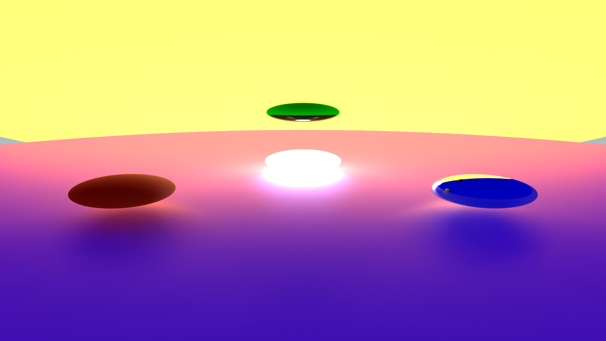

# Path Tracing distribué, méthode Monte Carlo

Ce projet effectué en licence d'informatique a pour but d'implémenter un moteur de rendu de primitives mathématiques par lancé de rayon. Nous avons finalisé le projet en développant une méthode de rendu Path Tracing avec une méthode Monte Carlo. Chaque objet possède un matériau PBR simplifié. Il est également possible d'animer les objets.

# Scènes
Les scènes sont implémentées dans l'exécutable. (cf `main.c` ou `mainmpi.c`)

# Compilation
**Pré-requis :**
- Un compilateur C (nous utilisons GCC)
- Un compilateur MPI, nous utilisons OpenMPI. 

Pour l'exécutable classique (sans MPI), vous aurez besoin de SDL2. (`apt install libsdl2-dev`)

Pour compiler le projet, il vous suffit d'exécuter le makefile à l'aide de la commande `make`

## Exécutable

Deux exécutables sont compilés:
- `start`: exécutable mono-thread avec fenêtre de prévisualisation.
- `startmpi` exécutable distribué avec OpenMPI.

# Lancer un rendu distribué

Pour lancer un rendu distribué, copiez la scène et recompilez l'exécutable MPI.

Puis lancé en distribué :
- `-n`: Nombre de processus exécutant le programme (1 processus/coeur CPU)
- `-hostfile` : fichier descriptif des machines disponibles pour le rendu.

Options pour`startmpi`dans l'ordre :
- `longueur` de l'image
- `largeur` de l'image
- `Images par secondes`
- `Temps total d'animation`
- `SSP (Sample Per Pixel)`

#### Exemple
Pour lancer un rendu en 1920*1080@24 fps avec 2s d'animation et 24000 SSP, sur 128 CPU distribués parmi une liste de machines `host.txt` :
`mpirun -n 128 -hostfile host.txt ./bin/startmpi 1920 1080 24 2 24000`

## Exemple de rendu

